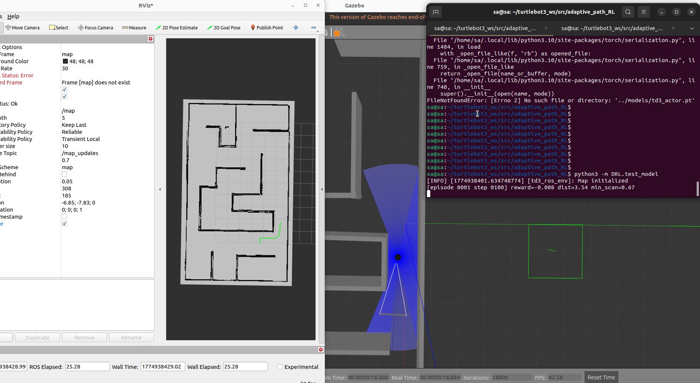

# Adaptive Path Planning with Reinforcement Learning



Пакет ROS2 для адаптивного планирования пути робота TurtleBot3 с использованием алгоритмов динамического программирования, оптимального управления и глубокого обучения.

## Описание проекта

Этот проект реализует гибридную систему навигации для мобильного робота TurtleBot3, интегрирующую классические алгоритмы планирования пути с методами глубокого обучения для компенсации возмущений и системных ошибок.

### Основные компоненты:

1. **D* (D-Star)** - алгоритм динамического переиспользования A*, позволяющий эффективно переплани​вать маршрут при появлении новых препятствий
2. **PMP v2 (Pontryagin Maximum Principle)** - оптимальное управление на основе принципа максимума Понтрягина с моделью дифференциального привода
3. **TD3 (Twin Delayed DDPG)** - агент глубокого обучения для компенсации возмущений и улучшения навигации

Проект интегрирован с:
- ROS2 (Robot Operating System 2)
- Gazebo (симуляторs)
- TurtleBot3 (мобильный робот)
- OpenCV (обработка карт)
- PyTorch (нейросетевые вычисления)

## Требования

- ROS2 (Humble или новее)
- Python 3.8+
- TurtleBot3 пакеты
- Gazebo
- OpenCV
- NumPy
- PyTorch (>=1.9.0)
- Gymnasium (или gym)

## Установка

### 1. Клонирование репозитория

```bash
cd ~/turtlebot3_ws/src
# Репозиторий уже находится в adaptive_path_RL
```


### 2. Сборка пакета

```bash
cd ~/turtlebot3_ws
colcon build --packages-select adaptive_path_RL
source install/setup.bash
```

### 3. Установка зависимостей

```bash
pip install -r requirements.txt
```

## Структура проекта

```
adaptive_path_RL/
├── adaptive_path_RL/          # Основной пакет Python
│   ├── navigation_src/        # Модуль планирования
│   │   ├── D_star.py          # Реализация D* алгоритма
│   │   ├── PMP.py             # Оригинальная реализация PMP
│   │   ├── pmp_v2.py          # Улучшенная версия PMP с дифф. приводом
│   │   └── navigation_node.py  # Основной ROS2 узел навигации
│   ├── DRL/                   # Модуль глубокого обучения
│   │   ├── environment.py      # Окружение Gym/Gymnasium для RL
│   │   ├── TD3.py             # Реализация TD3 алгоритма
│   │   ├── train_model.py      # Скрипт для тренировки агента
│   │   └── test_model.py       # Скрипт для тестирования агента
│   └── __init__.py
├── launch/                     # Launch файлы
│   ├── main.launch.py         # Основной launch (Gazebo, робот, навигация)
│   ├── robot_state_publisher.launch.py
│   └── spawn_turtlebot3.launch.py
├── maps/                       # Карты окружения
│   ├── map.pgm               # Изображение карты
│   ├── map.yaml              # Параметры карты
├── rviz/                     # Конфигурация RViz
│   └── def.rviz              
├── worlds/                     # Gazebo миры
│   └── maze.sdf              # Лабиринт для симуляции
├── models/                     # Сохраненные модели нейросетей
│   └── td3_actor.pt          # Веса актора TD3 (генерируется при тренировке)
├── test/                       # Тесты
└── package.xml               # Описание пакета ROS2
```

## Использование

### Запуск полной системы с Gazebo

```bash
ros2 launch adaptive_path_RL main.launch.py
```

### Запуск отдельных компонентов

```bash
# Запуск узла навигации (классические алгоритмы D*/PMP)
ros2 run adaptive_path_RL navigation_node
```

### Тренировка RL агента (TD3)

```bash
cd ~/turtlebot3_ws/src/adaptive_path_RL
python -m DRL.train_model \
    --episodes 600 \
    --max-steps 2000 \
    --batch-size 128 \
    --warmup-steps 5000 \
    --cuda  # опционально, для ускорения на GPU
```

**Параметры тренировки:**
- `--episodes`: количество эпизодов тренировки (default: 600)
- `--max-steps`: макс. шагов в эпизоде (default: 2000)
- `--batch-size`: размер батча для обновления (default: 128)
- `--warmup-steps`: шаги случайной разведки перед обучением (default: 5000)
- `--buffer-size`: размер буфера опыта (default: 300000)
- `--model-out`: путь сохранения модели (default: ../models/td3_actor.pt)
- `--cuda`: использовать GPU для обучения

### Тестирование RL агента

```bash
cd ~/turtlebot3_ws/src/adaptive_path_RL
python -m DRL.test_model \
    --model-path ./models/td3_actor.pt \
    --episodes 100 \
    --max-steps 2000
```

**Параметры тестирования:**
- `--model-path`: путь к сохраненной модели
- `--episodes`: количество тестовых эпизодов (default: 100)
- `--max-steps`: макс. шагов в эпизоде (default: 2000)
- `--print-every`: выводить результаты каждые N шагов (default: 100)
## Алгоритмы и методы

### D* (D-Star)

Алгоритм улучшение A*, используется для быстрого переплани​рования при обновлении карты. Основные характеристики:
- Эффективное обновление при изменении стоимостей ребер
- Поддержка динамических препятствий
- Сложность: O(n log n) в большинстве случаев

**Класс:** `DStar` в [navigation_src/D_star.py](adaptive_path_RL/navigation_src/D_star.py)

### PMP v2 (Pontryagin Maximum Principle)

Оптимальное управление на основе принципа максимума Понтрягина. Использует модель дифференциального привода:
- Оптимальные управления (линейная и угловая скорость)
- Минимизация времени прохождения траектории
- Поддержка ограничений на управления
- Локальное управление с упреждением (lookahead)

**Класс:** `DifferentialDriveModel`, `Hamiltonian` в [navigation_src/PMP.py](adaptive_path_RL/navigation_src/PMP.py)

### TD3 (Twin Delayed DDPG) - Глубокое обучение

Агент глубокого обучения на основе алгоритма Twin Delayed DDPG для компенсации возмущений и улучшения навигации:

**Архитектура:**
```
Генератор траектории (D*/PMP)
    ↓
Контроллер траектории (PMP)
    ↓
RL агент (TD3) [остатокнаправления]
    ↓
Команды управления (cmd_vel)
    ↓
Контроллер робота (TurtleBot3)
```

**Основные характеристики:**
- Два независимых Critic сети для стабилизации обучения
- Отложенное обновление политики (Policy Delay)
- Target сети с мягким обновлением (soft updates)
- Компенсация возмущений: проскальзывание, ветровое воздействие, разрядка батареи
- State: расстояние до цели, ошибка ориентации, данные лидара (8 лучей)
- Action: остаток линейной и угловой скорости (residual action)

**Классы:** `TD3`, `Actor`, `Critic` в [DRL/TD3.py](adaptive_path_RL/DRL/TD3.py)

**Окружение (Gym/Gymnasium):** [DRL/environment.py](adaptive_path_RL/DRL/environment.py)
- Интеграция с ROS2 топиками
- Симуляция возмущений (slip, wind, battery drains)
- Награды за прогресс и штрафы за коллизии

## ROS2 интеграция

### Издаваемые топики

- `/plan` - запланированная траектория (классические алгоритмы)
- `/cost_map` - карта стоимостей
- `/path_marker` - визуализация в RViz
- `/cmd_vel` - команды управления роботом (скорости)

### Подписываемые топики

- `/map` - входящая карта окружения (OccupancyGrid)
- `/odom` - одометрия робота (Odometry)
- `/scan` - данные лидара (LaserScan)
- `/goal_pose` - целевая позиция (PoseStamped)

### Параметры узла навигации

- `expansion_size` - размер расширения препятствий (пиксели)
- `map_frame` - фрейм карты
- `robot_radius` - радиус робота (метры)

## Обработка карт

Система использует карты в формате:
- **PGM** (Portable Graymap) - растровое изображение карты
- **YAML** - метаинформация (разрешение, начало координат и т.д.)

Процесс обработки:
1. Загрузка карты из файлов PGM/YAML
2. Расширение препятствий с использованием морфологических операций (cv2.dilate)
3. Создание карты стоимостей для планирования
4. Преобразование между координатами мира и сетки карты

## Примеры использования

### Пример 1: Навигация с классическими алгоритмами

```bash
# Терминал 1: Запуск основной системы
ros2 launch adaptive_path_RL main.launch.py

# Терминал 2: Публикация целевой позиции
ros2 topic pub /goal_pose geometry_msgs/PoseStamped \
  '{header: {frame_id: "map"}, pose: {position: {x: 5.0, y: 5.0, z: 0.0}, 
   orientation: {x: 0.0, y: 0.0, z: 0.0, w: 1.0}}}'
```

### Пример 2: Тренировка TD3 агента

```bash
# Убедитесь, что Gazebo с лабиринтом запущен
ros2 launch adaptive_path_RL main.launch.py

# В другом терминале запустите тренировку
cd ~/turtlebot3_ws/src/adaptive_path_RL
python -m DRL.train_model \
    --episodes 200 \
    --max-steps 1000 \
    --batch-size 256 \
    --warmup-steps 2000
```

### Пример 3: Оценка натренированного агента

```bash
ros2 launch adaptive_path_RL main.launch.py

# В другом терминале
cd ~/turtlebot3_ws/src/adaptive_path_RL
python -m DRL.test_model \
    --model-path ./models/td3_actor.pt \
    --episodes 50 \
    --print-every 50
```

## Текущее состояние и расширения

### Реализованные функции

✅ D* алгоритм планирования пути

✅ PMP алгоритм оптимального управления  

✅ TD3 агент для компенсации возмущений

✅ Интеграция с ROS2 и Gazebo

✅ Визуализация в RViz

✅ Тренировка и тестирование RL агента

### Планируемые расширения

- [ ] Адаптивное обновление карты в реальном времени
- [ ] Работа в полностью неизвестном окружении
- [ ] Hierarchical RL для выбора стратегии (классика vs RL)

## Быстрый старт

### 1. Сборка пакета

```bash
cd ~/turtlebot3_ws
colcon build --packages-select adaptive_path_RL
source install/setup.bash
```

### 2. Запуск базовой навигации

```bash
ros2 launch adaptive_path_RL main.launch.py
```

Это запустит:
- Gazebo с лабиринтом
- RViz для визуализации
- AMCL локализацию
- Узел навигации

## Документация и ссылки

- [ROS2 документация](https://docs.ros.org/en/humble/)
- [TurtleBot3 документация](https://emanual.robotis.com/docs/en/platform/turtlebot3/)
- [Gazebo документация](https://gazebosim.org/)
- [PyTorch документация](https://pytorch.org/docs/)
- [D* Algorithm](https://en.wikipedia.org/wiki/D*)
- [Pontryagin Maximum Principle](https://en.wikipedia.org/wiki/Pontryagin%27s_maximum_principle)
- [TD3 Algorithm Paper](https://arxiv.org/abs/1802.09477)

## Лицензия

Apache-2.0

## Автор

https://github.com/smakopyan/

## Известные ограничения и TODO

- Текущая реализация работает с статическими картами (динамическое обновление - в планах)
- Требует предварительно подготовленные карты в формате PGM/YAML
- TD3 агент требует достаточного времени на сходимость (200-300 эпизодов для базовых задач)